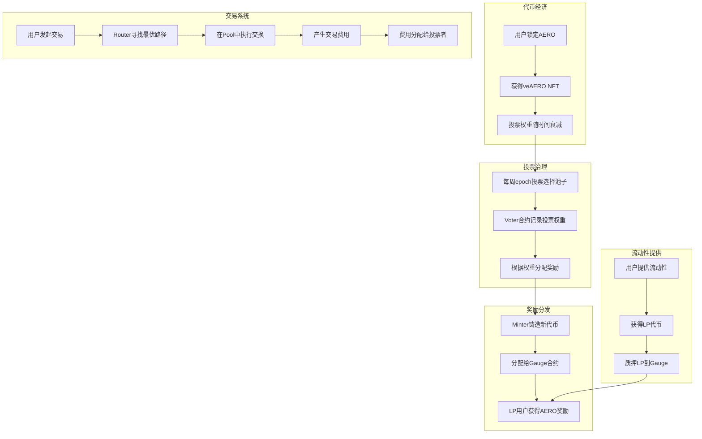
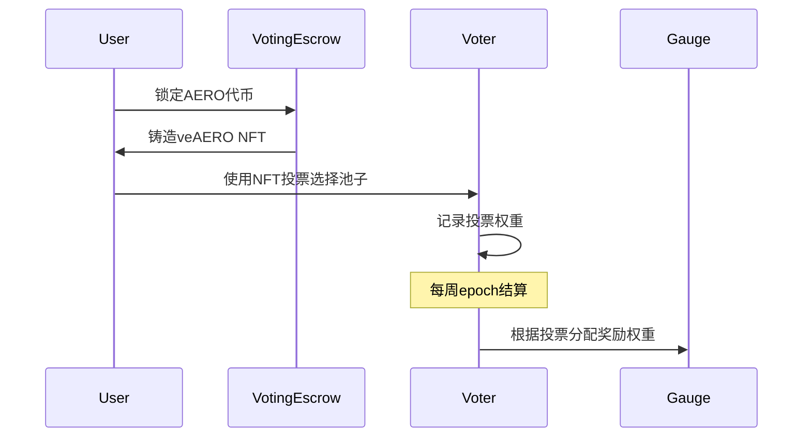
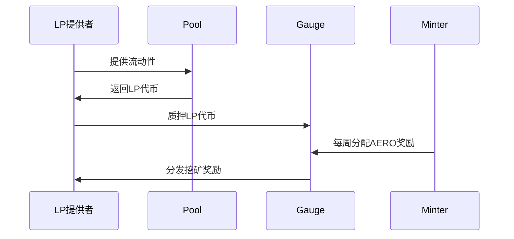
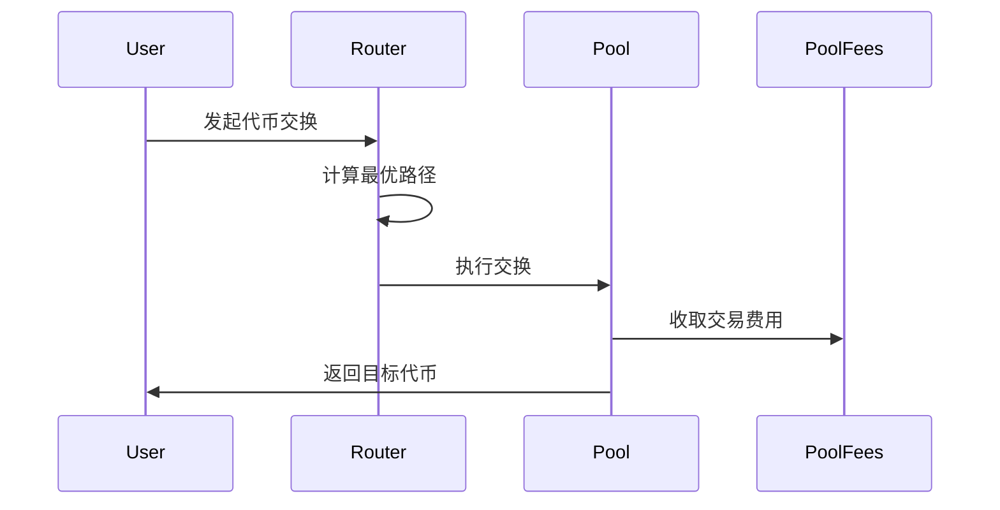

# Aerodrome 项目代码结构分析

## 项目概述
Aerodrome 是一个(DEX)协议，部署在 Base 链上。它是一个 AMM(自动做市商)协议，支持稳定币和波动性代币的交易，采用 veTokenomics 模型激励长期参与。
## 核心代码结构
### 1. 主要目录结构
```
contracts/
├── 核心合约/
│   ├── Aero.sol               # 原生代币合约 (ERC-20)
│   ├── VotingEscrow.sol       # veNFT投票锁定机制 (ERC-721)
│   ├── Pool.sol               # AMM流动性池
│   ├── Router.sol             # 路由合约
│   ├── Voter.sol              # 投票治理合约
│   ├── Minter.sol             # 代币铸造合约
│   ├── RewardsDistributor.sol # 奖励分发合约
│   ├── PoolFees.sol           # 费用收集合约
│   └── VeArtProxy.sol         # NFT艺术代理合约
├── factories/                 # 工厂合约目录
│   ├── FactoryRegistry.sol    # 工厂注册表
│   ├── PoolFactory.sol        # 池子工厂
│   ├── GaugeFactory.sol       # 挖矿合约工厂
│   ├── VotingRewardsFactory.sol # 投票奖励工厂
│   └── ManagedRewardsFactory.sol # 托管奖励工厂
├── gauges/                    # 流动性挖矿合约
│   └── Gauge.sol              # 主要挖矿合约
├── governance/                # 治理模块
│   ├── ProtocolGovernor.sol   # 协议治理
│   ├── EpochGovernor.sol      # 周期治理
│   └── GovernorSimple.sol     # 简单治理实现
├── rewards/                   # 奖励机制
│   ├── BribeVotingReward.sol  # 贿赂投票奖励
│   ├── FeesVotingReward.sol   # 费用投票奖励
│   ├── ManagedReward.sol      # 托管奖励
│   ├── FreeManagedReward.sol  # 自由托管奖励
│   └── LockedManagedReward.sol # 锁定托管奖励
├── interfaces/                # 接口定义
├── libraries/                 # 工具库
│   ├── BalanceLogicLibrary.sol # 余额逻辑库
│   ├── DelegationLogicLibrary.sol # 委托逻辑库
│   └── ProtocolTimeLibrary.sol # 时间协议库
└── art/                       # NFT艺术生成
    ├── PerlinNoise.sol        # 噪声算法
    └── Trig.sol               # 三角函数库
```
### 2. 核心合约分析
#### 代币经济模型 (Tokenomics)
- **Aero.sol**: 
  - ERC-20 原生代币合约
  - 由 Minter 控制铸造权限
  - 支持 ERC-20 Permit 扩展

- **VotingEscrow.sol**: 
  - veAERO NFT 系统 (ERC-721)
  - 锁定 AERO 获得投票权，最长4年
  - 投票权重随时间线性衰减
  - 支持合并、分割和托管 NFT

- **Minter.sol**: 
  - 控制代币发行和分配
  - 包含每周衰减机制 (99%)
  - 分配给 Voter 和 RewardsDistributor

#### AMM 交易系统

- **Pool.sol**: 
  - Uniswap V2 风格的流动性池
  - 支持稳定币池 (`x³y + y³x` 曲线) 和波动性池 (恒定乘积)
  - 自定义费用设置
  - 价格预言机功能

- **Router.sol**: 
  - 多池路由交换
  - 支持复杂的交换路径
  - Zapping 功能 (一键添加/移除流动性)
  - 支持 fee-on-transfer 代币

- **PoolFees.sol**: 
  - 独立的费用收集合约
  - 与流动性池分离存储
  - 便于费用管理和分配

- **PoolFactory.sol**: 
  - 池子创建和管理
  - 支持暂停/恢复功能
  - 费用管理权限控制

#### 治理与投票

- **Voter.sol**: 
  - 核心投票合约
  - 管理每周 epoch 投票
  - 根据投票权重分配奖励
  - 创建和管理 Gauge

- **Gauge.sol**: 
  - 流动性挖矿激励合约
  - 基于投票权重分发 AERO 奖励
  - 7天奖励释放周期

- **ProtocolGovernor.sol**: 
  - 协议级治理合约
  - 基于 OpenZeppelin Governor
  - 控制代币白名单、发行参数等

- **EpochGovernor.sol**: 
  - 专门处理发行量调整的治理合约
  - 简化的投票机制

## 核心工作流程

### 整体架构流程图



### 关键流程详解

#### 1. 锁定与投票机制



#### 2. 流动性挖矿流程



#### 3. 交易执行流程



## 技术特点

### 1. 双池模型设计

- **稳定币池**: 使用 `x³y + y³x` 曲线，适用于相似价值代币，提供低滑点交易
- **波动性池**: 使用恒定乘积公式 `x*y=k`，适用于价格波动较大的代币对

### 2. veTokenomics 机制

- **时间锁定**: 最长4年锁定期，锁定时间越长投票权重越高
- **线性衰减**: 投票权重随时间线性递减，激励持续参与
- **NFT 形式**: 以 ERC-721 NFT 形式存在，支持转移和交易

### 3. 灵活的工厂系统

- **可升级性**: 通过工厂模式支持协议升级
- **向后兼容**: 新版本不影响现有合约
- **权限管理**: 细粒度的权限控制

### 4. 完善的奖励机制

- **投票奖励**: 投票者获得池子交易费用分成
- **流动性奖励**: LP 提供者获得 AERO 代币奖励
- **贿赂机制**: 第三方可以贿赂投票者支持特定池子
- **托管奖励**: 支持专业化的奖励管理

### 5. Gas 优化

- **库合约**: 使用库合约优化重复计算逻辑
- **状态最小化**: 精简状态变量减少存储成本
- **批量操作**: 支持批量处理减少交易次数

## 部署配置

### 开发工具链

- **Foundry**: 主要开发和测试框架
- **Foundry**: 核心测试与部署工具
- **OpenZeppelin**: 安全合约库

### 网络支持

- **Base 主网**: 主要部署网络
- **Base Goerli**: 测试网络
- **Tenderly**: 模拟和调试

### 配置文件

#### Base.json 主要配置
```json
{
  "feeManager": "费用管理者地址",
  "emergencyCouncil": "紧急委员会地址", 
  "team": "团队地址",
  "WETH": "包装ETH地址",
  "whitelistTokens": ["白名单代币列表"],
  "pools": ["初始池子配置"],
  "minter": {
    "liquid": "流动分配",
    "locked": "锁定分配"
  }
}
```

## 安全考虑

### 1. 权限管理
- **多重签名**: 关键操作需要多重签名
- **时间锁**: 重要参数变更有时间锁保护
- **紧急暂停**: 支持紧急情况下暂停功能

### 2. 经济安全
- **滑点保护**: 交易滑点限制
- **MEV 抗性**: 通过设计减少可提取价值
- **闪电贷防护**: 防止闪电贷攻击

### 3. 合约安全
- **重入保护**: 使用 ReentrancyGuard
- **溢出保护**: 使用 SafeMath 库
- **权限验证**: 严格的权限检查

## 总结

Aerodrome 是一个设计完善的 DeFi 协议，具有以下核心优势：

1. **创新的代币经济学**: veTokenomics 模型有效激励长期参与
2. **高效的 AMM 设计**: 双池模型适应不同交易场景
3. **完善的治理机制**: 去中心化治理与专业化管理相结合
4. **可扩展的架构**: 工厂模式支持协议持续演进
5. **用户友好**: 简化的操作流程和良好的用户体验
